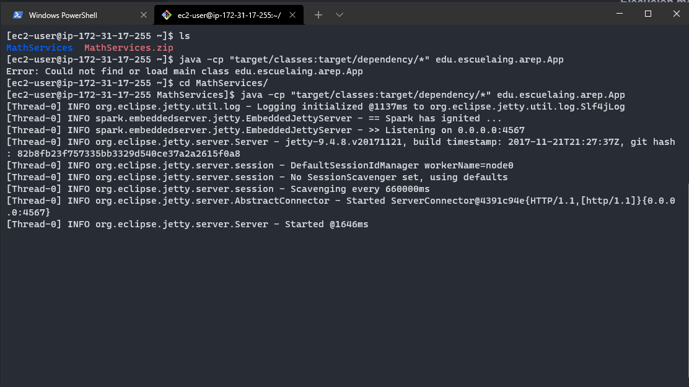

# Parcial # 2 AREP
Aplicación en la cual mediante queryparams podremos obtener como resultado la tangente y el arcocoseno de un número.
## Instrucciones de Uso

### Prerrequisitos
* git version 2.25.1
* Apache Maven versión: 4.0.0
* java versión: "1.8.0"

### Ejecución
Para poder usar el proyecto lo primero que se debe realizar es clonar el proyecto utilizando el siguiente comando desde una terminal:
```
git clone https://github.com/Desarik98/AREP-parcial2.git
```
En este repositorio se encuentran dos API, una que contiene la calculadora en la que podremos realizar las funciones trigonométricas de tangente y arcocoseno, 
y la otra API utiliza un algoritmo RoundRobin la cual podrá conectarse a 2 instancias de EC2 en donde se encontrará en cada una el servicio de calculadora en funcionamiento 
y retornar la respuesta gracias a la conexión del RoundRobin con estas instancias.

Por lo que primero ingresaremos desde la terminal al directorio MathServices y para ejecutarlo utilizaremos el siguiente comando:
```
java -cp "target/classes:target/dependency/*" edu.escuelaing.arep.App
```

Posteriormente ingresaremos desde la terminal al directorio de RoundRobin y para ejecutarlo sin parar la ejecución de MathServices ingresaremos el siguiente comando (es el mismo comando para ejecutar MathServices):
```
java -cp "target/classes:target/dependency/*" edu.escuelaing.arep.App
```


### Arquitectura
La arquitectura de esta infraestructura está dada por el siguiente diagrama:


En donde el usuario podrá ingresar mediante un navegador a una instancia EC2 t3a.micro sobre la cual estará montada la API que contiene del algoritmo RoundRobin y esta
a su vez estará conectada a otras 2 instancias EC2 t3a.micro las cuales tendrán toda la lógica para obtener los resultados de las operaciones tangente y arcocoseno.

**Ejemplo de Respuesta**

```
{
    "operation": "tan",
    "input": 1,
    "output": 1.55740772465
}
```

### Ejecución mediante AWS


Para poder observar la correcta implementación de la arquitectura lo primero a realizar es obtener acceso a cada una de las instancias y ejecutar la aplicación java.
Primero obtendremos el acceso a las instancias que contienen la API MathService, asi que accederemos a la consola de AWS y seleccionaremos la instancia MathServicePrimer, le daremos 
al botón conectar y accederemos mediante una terminal Linux en el directorio en donde se encuentra la llave .pem dada por AWS, a estas instancias accederemos mediante el protocolo SSH


Una vez dentro, observaremos que se encuentra una carpeta llamada MathServices, a la cual accederemos mediante el comando:

```
cd MathServices
```

y ejecutaremos el siguiente comando para ejecutar el MathService:

```
java -cp "target/classes:target/dependency/*" edu.escuelaing.arep.App
```


En la imagen podemos observar la ejecución de la API mediante Spark.

Repetiremos el mismo procedimiento anterior pero con la instancia MathServiceSecond y RoundRobin, sin parar la ejecución de MathServicePrimer. Por lo tanto, lo haremos sobre otra consola


Dentro de la instancia de RoundRobin, en lugar de la carpeta MathService se encontrará la carpeta RoundRobin, ingresaremos a esta carpeta mediante el comando:

```
cd RoundRobin
```

y utilizaremos el mismo comando de ejecución:

```
java -cp "target/classes:target/dependency/*" edu.escuelaing.arep.App
```


A continuación ingresaremos a la siguiente dirección que contiene la API RoundRobin probando la operación tangente:

```
http://ec2-34-235-89-249.compute-1.amazonaws.com:4567/tan?value=5
```

Y se mostrará el siguiente resultado:


## Tecnologías usadas
- Maven
- Java
- Spark
- AWS EC2

## Autor
- Daniel Alejandro Mejía Rojas - Fecha: 14/10/2021

## Licencia
This project is licensed under the Gnu General Public License - see the LICENSE file for details